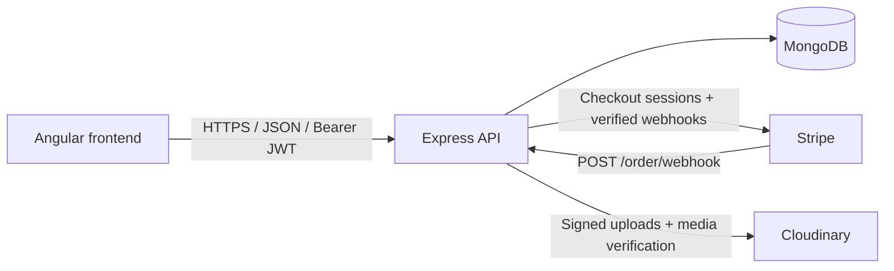
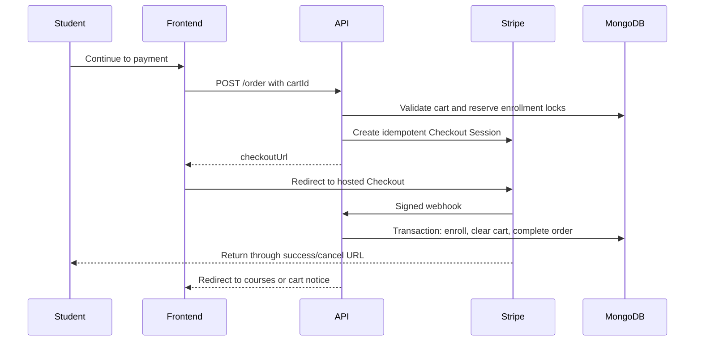

# Education Platform API

Production-oriented REST API for a role-based education platform. The API
manages users, courses, lessons, assignments, final tests, feedback, enrollment,
Cloudinary media, and Stripe Checkout.

The backend is written in JavaScript with Node.js, Express, MongoDB, and
Mongoose. No backend TypeScript is required.

## Contents

- [Architecture](#architecture)
- [Features](#features)
- [Technology](#technology)
- [Requirements](#requirements)
- [Local setup](#local-setup)
- [Demo accounts](#demo-accounts)
- [Environment variables](#environment-variables)
- [API overview](#api-overview)
- [Authentication and authorization](#authentication-and-authorization)
- [Stripe payment lifecycle](#stripe-payment-lifecycle)
- [Uploads](#uploads)
- [Data relationships and migrations](#data-relationships-and-migrations)
- [Health, monitoring, and logging](#health-monitoring-and-logging)
- [Testing](#testing)
- [Deployment](#deployment)
- [Production checklist](#production-checklist)
- [Additional documentation](#additional-documentation)

## Architecture



The main request pipeline is configured in `src/initapp.js`:

1. Add defensive response headers.
2. Assign a request ID and start request metrics.
3. Serve liveness, readiness, and protected metrics endpoints.
4. Reuse or establish the MongoDB connection.
5. Process the Stripe webhook using the untouched raw body.
6. Apply strict CORS rules.
7. Apply the distributed MongoDB-backed API rate limit.
8. Parse bounded JSON bodies.
9. Reject unsafe MongoDB/operator field names.
10. Dispatch application routes.
11. Normalize 404 and application errors.

The Stripe webhook is registered before `express.json()`. Stripe signature
verification requires the exact raw request body.

## Features

- Registration, login, logout, profile management, and role-based access.
- Asynchronous bcrypt password hashing and comparison.
- Account/IP login throttling.
- Revocable JWT sessions using token IDs and token versions.
- Course, schedule, instructor, lesson, assignment, and final-test management.
- Student carts and Stripe-hosted Checkout.
- Enrollment only after verified successful payment.
- Idempotent payment processing and duplicate-enrollment protection.
- Assignment and final-test submissions with grading and feedback.
- Direct signed video upload to Cloudinary.
- PDF content validation for assignments and submissions.
- Joi validation on application mutation endpoints.
- MongoDB transactions for multi-collection destructive operations.
- Pagination, indexes, request IDs, structured logs, health checks, and metrics.
- Migration and staging-readiness utilities.

## Technology

| Area | Technology |
| --- | --- |
| Runtime | Node.js 18+ |
| Web framework | Express 4 |
| Database | MongoDB and Mongoose |
| Validation | Joi |
| Authentication | JSON Web Tokens and bcrypt |
| Payments | Stripe Checkout and signed webhooks |
| Media | Cloudinary and Multer |
| Tests | Node.js test runner |
| Hosting | Vercel-compatible serverless entry point |

## Requirements

- Node.js 18 or newer.
- npm.
- MongoDB Atlas or another replica-set deployment.
- Cloudinary account.
- Stripe account.
- Angular frontend configured with the backend origin.

MongoDB transactions require a replica set. MongoDB Atlas supports
transactions; a standalone local MongoDB process does not.

## Local setup

1. Clone the repository.
2. Install exact dependencies:

   ```sh
   npm ci
   ```

3. Copy `.env.example` to `.env`.
4. Fill the local database, Stripe, Cloudinary, JWT, and monitoring values.
5. Start the development server:

   ```sh
   npm run dev
   ```

6. Verify the API:

   ```text
   GET http://localhost:3000/health/live
   GET http://localhost:3000/health/ready
   ```

For a production-style local start:

```sh
npm start
```

## Demo accounts

> **Warning**
>
> These credentials are intentionally documented for an isolated local or
> staging demo only. Never create these accounts in production, never reuse
> this password for a real person, and never connect a public demo deployment
> to production data or live Stripe keys.

| Role | Email | Password |
| --- | --- | --- |
| Instructor | `instructor@gmail.com` | `@Mm123456` |
| Admin | `admin@gmail.com` | `@Mm123456` |

The README does not create these users. They must already exist in the local or
staging database with `role: "Instructor"` and `role: "Admin"` respectively.
Public registration always creates `role: "User"`; clients cannot select a
privileged role during registration.

## Environment variables

Use `.env` only for local development. Store Preview and Production values in
the deployment platform's encrypted environment-variable settings. The same
variable names can have different values in each environment.

### Required in production

| Variable | Purpose |
| --- | --- |
| `NODE_ENV` | Use `production` on the production deployment |
| `DB_URL` | MongoDB connection string |
| `JWT_SECRET` | JWT HMAC signing secret; minimum 32 characters |
| `STRIPE_SECRET_KEY` | Server-side Stripe key |
| `STRIPE_WEBHOOK_SECRET` | Signing secret for this deployment's webhook endpoint |
| `PUBLIC_API_URL` | Public backend origin without a trailing slash |
| `FRONTEND_URL` | Public frontend origin without a trailing slash |
| `CLOUDINARY_CLOUD_NAME` | Cloudinary cloud identifier |
| `CLOUDINARY_API_KEY` | Cloudinary API key |
| `CLOUDINARY_API_SECRET` | Cloudinary server secret |
| `MONITORING_TOKEN` | Bearer token protecting `/health/metrics` |

### Optional tuning

| Variable | Default | Purpose |
| --- | ---: | --- |
| `PORT` | `3000` | Local server port; Vercel controls its own port |
| `DB_NAME` | `educationPlatform` | MongoDB database name |
| `SALT_ROUNDS` | `12` | bcrypt work factor; accepted range is 8–15 |
| `CORS_ORIGINS` | empty | Additional comma-separated frontend origins |
| `JSON_BODY_LIMIT` | `1mb` | Express JSON body limit |
| `API_RATE_LIMIT_WINDOW_MINUTES` | `15` | General API limit window |
| `API_RATE_LIMIT_MAX_REQUESTS` | `300` | Requests allowed per IP/window |
| `API_RATE_LIMIT_SECRET` | falls back to `JWT_SECRET` | Hashing secret for rate-limit identities |
| `LOGIN_THROTTLE_WINDOW_MINUTES` | `15` | Login failure window |
| `LOGIN_ACCOUNT_ATTEMPT_LIMIT` | `5` | Failed attempts per account |
| `LOGIN_IP_ATTEMPT_LIMIT` | `25` in code | Failed attempts per IP |
| `LOGIN_THROTTLE_SECRET` | falls back to `JWT_SECRET` | HMAC secret for throttle identities |

Generate independent secrets with:

```sh
node -e "console.log(require('node:crypto').randomBytes(32).toString('hex'))"
```

Do not expose server secrets in the Angular application.

## API overview

All routes are relative to the API origin.

### Health

| Method | Route | Access | Purpose |
| --- | --- | --- | --- |
| GET | `/health/live` | Public | Process liveness |
| GET | `/health/ready` | Public | Database and required-configuration readiness |
| GET | `/health/metrics` | Monitoring bearer token | Process/request metrics |

Call protected metrics with:

```sh
curl https://api.example.com/health/metrics \
  -H "Authorization: Bearer <MONITORING_TOKEN>"
```

### Users and authentication

| Method | Route | Access |
| --- | --- | --- |
| POST | `/user` | Public registration |
| POST | `/user/login` | Public |
| POST | `/user/logout` | Authenticated |
| GET | `/user` | Authenticated |
| PATCH | `/user` | Authenticated |
| POST | `/user/profile` | Authenticated |
| GET | `/user/allUsers?page=1&limit=25` | Admin |
| DELETE | `/user/deleteUser` | Admin |

### Courses and lessons

| Method | Route | Access |
| --- | --- | --- |
| GET | `/course?page=1&limit=25` | Public |
| POST | `/course` | Admin or instructor |
| PATCH | `/course/:courseId/instructor` | Admin |
| DELETE | `/course/:courseId` | Course manager |
| POST | `/course/:courseId/cover` | Course manager |
| GET | `/leason/course/:courseId` | Authorized course access |
| POST | `/leason` | Admin or instructor |
| POST | `/leason/:lessonId/video/signature` | Lesson manager |
| POST | `/leason/:lessonId/video/complete` | Lesson manager |
| POST | `/leason/:lessonId/submit` | Lesson manager |
| GET | `/leason/:lessonId/assignment/download` | Authorized course access |

The legacy spelling `leason` remains part of the public API and model name.
Changing it requires a coordinated API and database migration.

### Cart and enrollment

| Method | Route | Access |
| --- | --- | --- |
| GET | `/cart/getCart` | Student |
| POST | `/cart/addToCart` | Student |
| DELETE | `/cart/course` | Student |
| DELETE | `/cart/clear` | Student |
| POST | `/order` | Student |
| GET | `/order/enrolled-courses` | Authenticated |
| GET | `/order/payment/success` | Stripe redirect |
| GET | `/order/payment/cancel` | Stripe redirect |
| POST | `/order/webhook` | Stripe signature |

### Assignment submissions

| Method | Route | Access |
| --- | --- | --- |
| POST | `/submittedAssignment/:lessonId/submissions` | Student |
| GET | `/submittedAssignment/submissions?page=1&limit=25` | Student |
| GET | `/submittedAssignment/my-submissions/:submissionId/download` | Submission owner |
| GET | `/submittedAssignment/review?page=1&limit=25` | Admin or instructor |
| POST | `/submittedAssignment/:submissionId/grade` | Submission manager |
| GET | `/submittedAssignment/:submissionId/download` | Submission manager |

### Final tests

| Method | Route | Access |
| --- | --- | --- |
| POST | `/finalTest/course/:courseId/create` | Course manager |
| GET | `/finalTest/course/:courseId/file` | Authorized course access |
| POST | `/finalTest/course/:courseId/submit` | Student |
| GET | `/finalTest/feedback?page=1&limit=25` | Student |
| GET | `/finalTest/review?page=1&limit=25` | Admin or instructor |
| POST | `/finalTest/:submissionId/grade` | Submission manager |
| GET | `/finalTest/submission/:submissionId/download` | Submission manager |

### Common response behavior

- Validation failures: HTTP `400`, code `VALIDATION_ERROR`.
- Missing or invalid authentication: HTTP `401`.
- Forbidden resource/role access: HTTP `403`.
- Missing resources/routes: HTTP `404`.
- Duplicate or concurrent operation: HTTP `409`.
- File too large: HTTP `413`.
- General rate limit or login throttle: HTTP `429` with `Retry-After`.
- Unexpected production errors: HTTP `500` with a generic public message.

Paginated endpoints accept `page` and `limit`. `limit` is bounded from 1 to
100. Course results remain an array for frontend compatibility and expose
pagination values through `X-Pagination-*` headers.

## Authentication and authorization

Passwords are hashed asynchronously with bcrypt. Login performs a dummy
password comparison for unknown accounts to reduce account-timing differences.
Failed login identities are stored as HMAC values rather than raw email/IP
values.

Access tokens contain:

- user identity and role;
- a unique JWT ID (`jti`);
- the user's `tokenVersion`;
- issued and expiration timestamps.

Authenticated requests verify the signature, expiration, user record, token
version, and revocation collection. Logout records the token ID until its
expiration. TTL indexes automatically remove expired throttling and revocation
records.

The current implementation uses HS256 through `JWT_SECRET`. A public/private
key pair is not required while one backend creates and verifies its own tokens.

Frontend route guards improve navigation, but backend role and resource checks
are authoritative.

## Stripe payment lifecycle

The API does not accept a client-controlled `paymentMethod`. Checkout is
Stripe-only, and enrollment never occurs when an order is initially created.



Important invariants:

- New orders start in `awaiting_payment` with payment status `pending`.
- Enrollment is created only for a verified paid Checkout Session.
- Order completion, enrollment creation, cart deletion, and lock release occur
  in one MongoDB transaction.
- A Stripe session cannot complete an unrelated order.
- Duplicate webhook deliveries are safe.
- The cart is preserved after cancellation or failed payment.
- Enrollment locks prevent overlapping purchases of the same course.
- Stripe API creation uses an idempotency key based on the order ID.

Configure the production webhook as:

```text
https://<backend-domain>/order/webhook
```

Subscribe to:

- `checkout.session.completed`
- `checkout.session.async_payment_succeeded`
- `checkout.session.async_payment_failed`
- `checkout.session.expired`

Use the signing secret shown for that exact endpoint and Stripe mode as
`STRIPE_WEBHOOK_SECRET`.

## Uploads

### Images

- Profile/course images are limited by MIME allowlists and Multer size limits.
- Replaced Cloudinary images are cleaned up.
- Temporary disk uploads are removed on success and on validation failure.

### PDFs

- Assignment, submission, and final-test files must declare
  `application/pdf`.
- The server additionally checks the `%PDF-` file signature.
- JavaScript MIME types are not accepted.
- PDF uploads are limited to 10 MB.

### Lesson videos

Large videos do not pass through the serverless API:

1. The frontend requests a signed upload definition.
2. The browser uploads directly to Cloudinary.
3. The frontend sends Cloudinary's result to the completion endpoint.
4. The backend verifies the signature, folder, Cloudinary resource, format,
   size, URL, and resource type before saving it.

The current maximum lesson-video size is 500 MB.

## Data relationships and migrations

Each relationship now has one source of truth:

| Relationship | Source of truth |
| --- | --- |
| Course schedules | Embedded `Course.schedules` |
| Course lessons | `Lesson.courseId` |
| Course final test | `FinalTest.courseId` |
| Lesson submissions | `SubmittedAssignment.lessonId` |
| Final-test submissions | `SubmittedFinalTest.finalTestId` |

Before applying the migration:

```sh
npm run migrate:course-relations:check
```

After reviewing the preview and creating a backup:

```sh
npm run migrate:course-relations
npm run migrate:course-relations:check
```

The apply command uses a transaction. Read
[`MIGRATIONS.md`](./MIGRATIONS.md) before running it.

## Health, monitoring, and logging

Every request receives an `X-Request-Id`. Logs are emitted as one JSON object
per line and include request method, path, status, duration, user ID, and role
when available. Unexpected errors include the same request ID.

`/health/ready` performs a real MongoDB ping and checks required production
configuration. It returns `503` while the application is not ready.

`/health/metrics` reports in-process counters, latency averages, status
buckets, uptime, and memory. On serverless hosting these values are
instance-local. Use the structured logs and a real monitoring provider for
cross-instance aggregation and alerting.

## Testing

Run all backend tests:

```sh
npm test
```

The suite covers:

- Stripe event classification and payment lifecycle;
- paid/unpaid enrollment behavior;
- idempotency and checkout response safety;
- normalized course relationships;
- authenticated feedback queries;
- file-type and PDF-content validation;
- transactions and cleanup;
- direct video upload verification;
- CORS, security headers, and unsafe input protection;
- mutation-route validation coverage;
- pagination and distributed rate limiting;
- production configuration checks;
- async password handling;
- login throttling;
- token IDs, versions, logout, and revocation.

The current suite contains 40 passing tests.

## Deployment

The repository exports the Express app from `index.js`. Local execution starts
an HTTP listener; Vercel imports the app without starting a second listener.
MongoDB connection promises are cached for warm serverless instances.

Before deploying:

1. Configure all required Production variables.
2. Use `sk_live_...` only in Production.
3. Create the live Stripe webhook and set its matching `whsec_...`.
4. Set exact `PUBLIC_API_URL` and `FRONTEND_URL` origins.
5. Configure the frontend CSP with the same backend origin.
6. Run tests and migration preview.
7. Verify `/health/ready`.

Environment-variable changes apply only to new deployments, so redeploy after
changing a value.

## Production checklist

- [ ] Demo credentials do not exist in production.
- [ ] All secrets that ever appeared in Git history have been rotated.
- [ ] Backend tests pass.
- [ ] Frontend tests and production build pass.
- [ ] A recent MongoDB backup has been restored successfully.
- [ ] Migration preview reports no unexpected changes.
- [ ] MongoDB transaction support is confirmed.
- [ ] Stripe live webhook is enabled with all required events.
- [ ] A real Stripe test-mode payment, cancellation, and retry were verified in staging.
- [ ] `/health/live` and `/health/ready` return `200`.
- [ ] `/health/metrics` rejects an invalid token and accepts the configured token.
- [ ] Request/error logs are connected to monitoring and alerting.
- [ ] Rollback and payment-reconciliation procedures are understood.

## Additional documentation

- [Course relationship migration](./MIGRATIONS.md)
- [Production operations and rollback](./PRODUCTION_OPERATIONS.md)
- [Vercel deployment guide](./VERCEL_DEPLOYMENT.md)
- Environment template: [`.env.example`](./.env.example)

## Security notice

Never commit database URLs, JWT secrets, Stripe keys, Cloudinary secrets, or
production account passwords. If a secret has been committed, deleting it from
the latest file is insufficient: rotate it immediately and use an approved
history-rewrite procedure.
